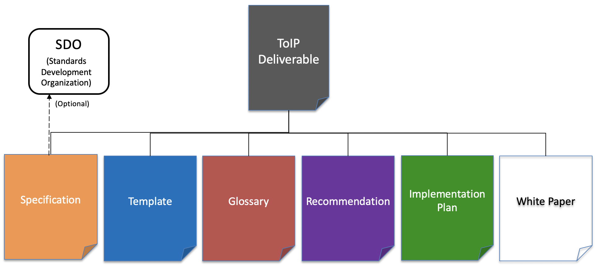

# ToIP Deliverables

Under our Linux Foundation Joint Development Foundation (JDF) charter, ToIP Foundation Working Groups (WGs) can produce a variety of [deliverable types](./_process/work_products.md). This repo covers the [lifecycle management process](./_process/lifecycle_management.md) for the work products ("deliverables") of the ToIP Foundation.

Figure 1: The six (6) primary types of ToIP Foundation deliverables

Table 1 summarizes the primary differences between these six types:

| Deliverable Type | Designed to be:|
| --- | --- |
| [Specification](./specs) | Implemented (in code)|
| [Template](./templates)  | Instantiated (as new documents) |
| [Glossary](./glossaries.md)  | Incorporated (in other documents) |
| [Recommendation](./recommendations)  | Followed (in practice) |
| [Implementation Plan](./plans)  | Executed (in operation) |
| [White Paper](./white-papers.md)  | Understood (to support decisions) |

Table 1: The primary differences between the six types of deliverables

## Getting Started
The ToIP Foundation maintains a variety of active and inactive activities that adhere to a specific process for the maturation and publication of deliverables that are relevant to:

* Work within the same working group
* Work within another working group
* Work within another community or [SDO](https://en.wikipedia.org/wiki/Standards_organization#Standards_developing_organizations_(SDOs))

There are several ways in which you can get acquainted with our work.

### Learn
If you are here to explore the work products of the ToIP Foundation, we recommend you use the [Deliverables Index](index.md) for a current listing of all work product efforts and their statuses.

### Contribute
If you have an idea for a new instance of one of our types of deliverables, please consider [making a contribution](./_process/contributing.md).

### Consume
The goal of the ToIP Foundation is to help define a complete architecture for Internet-scale digital trust that combines both cryptographic trust at the machine layer and human trust at the business, legal, and social layers. Our work products with be positioned at various levels of such an architecture and will mature at disparate rates. Please familiar yourself with the [lifecycle management process](./_process/lifecycle_management.md) for our deliverables and then when/where appropriate we welcome your feedback on how you plan or have consumed our work. Please keep us informed of your activities by submitted a `pull-request` against our [adoption matrix](adoption.md).

## About

#### License

This repository is licensed under an [Apache 2 License](LICENSE). It is protected
by a [Developer Certificate of Origin](https://developercertificate.org/) on every commit.
This means that any contributions you make must be licensed in an Apache-2-compatible
way, and must be free from patent encumbrances or additional terms and conditions. By
raising a PR, you certify that this is the case for your contribution.

For more instructions about contributing, see [Contributing](contributing.md).

#### Acknowledgement

This repo is derived from the structure and successful experience of [Hyperledger/Aries-RFCs](https://github.com/hyperledger/aries-rfcs), which was in part based on [Indy HIPEs](
https://github.com/hyperledger/indy-hipe), which borrowed it from [Rust RFC](https://github.com/rust-lang/rfcs).
Their good work has made the setup of this repository much quicker and better than it otherwise would have been.
If you are not familiar with the Rust community, you should check them out.
