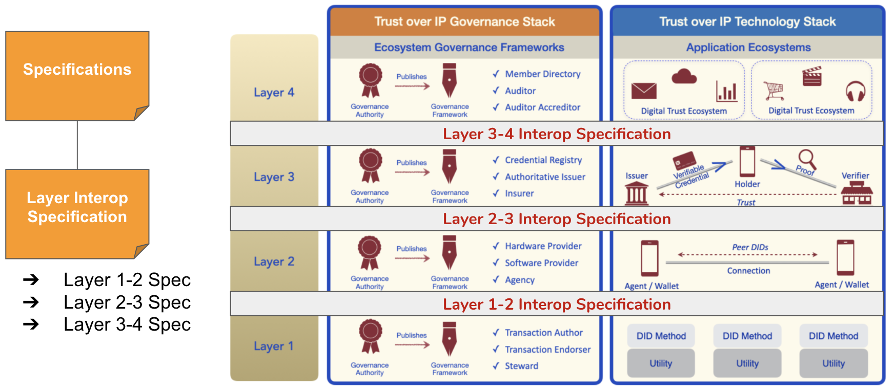
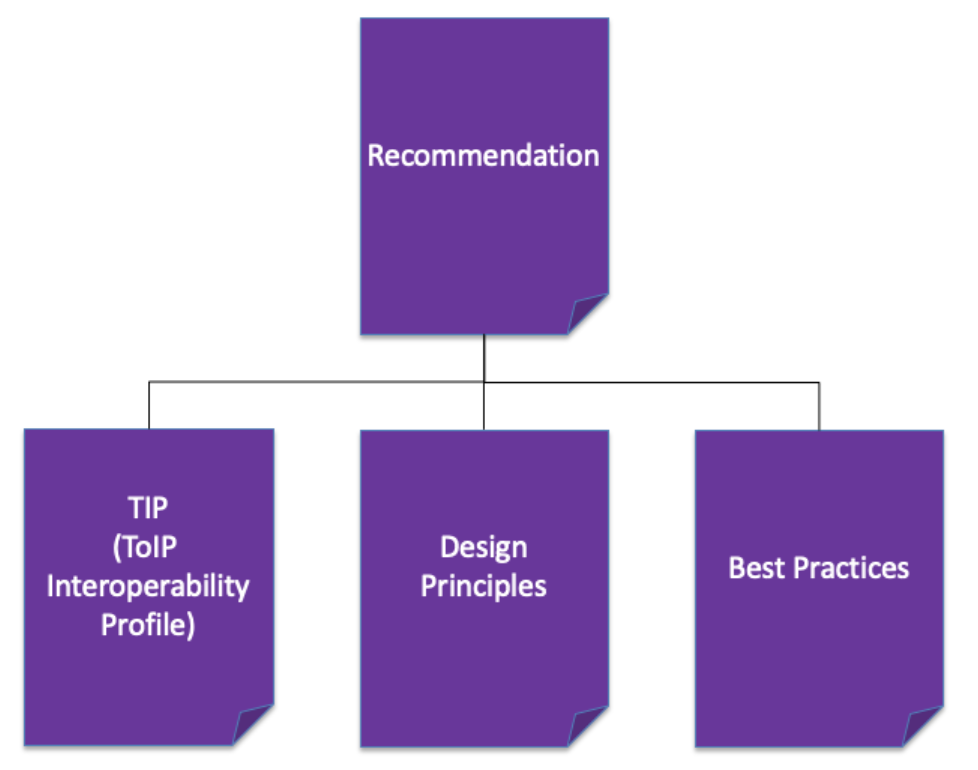

# ToIP Deliverables

This document describes the types of deliverables produced by the ToIP Foundation.

Figure 1: The six (6) primary types of ToIP Foundation deliverables

| Deliverable Type | Designed to be:|
| --- | --- |
| [Specification](../specs) | Implemented (in code)|
| [Template](../templates)  | Instantiated (as new documents) |
| [Definition](../definitions)  | Incorporated (in other documents) |
| [Recommendation](../recommendations)  | Followed (in practice) |
| [Implementation Plan](../plans)  | Executed (in operation) |
| [White Paper](../white_papers)  | Understood (to support decisions) |

Table 1: The primary differences between the six types of deliverables

### Specifications (TSS)
The most common deliverable under a JDF charter is a **specification**. At the ToIP Foundation, a standards-track specification is called a **TSS** (ToIP Standard Specification). This acronym was chosen to be our analog to the IETF **RFC** (Request for Comment).

Although most closely associated with technical standards (e.g., the province of the [Technical Stack WG](https://github.com/trustoverip/technical-stack-wg)), a TSS may also be produced by the [Governance Stack WG](https://github.com/trustoverip/governance-stack-wg) (for example to define requirements for discovery, identification, or machine-readability of governance frameworks). Any technically-oriented ToIP Foundation WG may produce a TSS.

A TSS is distinguished from other deliverables because it can be the basis for:

* **Implementations in source code**. A key test of any open standard specification is whether it can have multiple independent interoperable implementations in executable software code—in any choice of programming language.
* **Interoperability testing**. Conformance requirements in a specification can be used to create neutral, objective, machine-verifiable interoperability test suites.
* **Certification**. Interoperability testing can be the basis for official certification programs, whether offered by the ToIP Foundation, other Linux Foundation projects, or independent third party certification labs.
* **Official standardization**. Any specification produced under a JDF charter has the necessary intellectual property rights protections to be advanced to an official standards development organization (SDO—also called a standards setting organization* or SSO). Examples include ISO (with whom the Linux Foundation JDF projects have a special relationship), IETF, W3C, OASIS, etc. For ToIP specifications, this is the specific role of a ToIP Standard Specification (TSS), as described below.

Figure 2 illustrates this final point that a TSS produced under a Linux Foundation JDF project have a direct path to official standardization in a recognized SDO.

Figure 2: TSS have a direct path to become official standards.

There are three flavors of TSS depending on where the content originates:

* **Internal**: This type of TSS is developed entirely by a ToIP WG—for example the Overlays Capture Architecture (OCA) spec from the [Decentralized Semantics WG](https://wiki.trustoverip.org/display/HOME/Decentralized+Semantics+Working+Group).
* **External**: This is a profile of an open standard specification from another SDO—for example a profile of the [W3C Decentralized Identifiers (DIDs) Core 1.0](https://www.w3.org/TR/did-core/) spec.
* **Hybrid**: A combination of Internal and External.

#### Layer Interoperability Specifications
One of the responsibilities of the Governance and Technical Stack WGs is to publish specifications that address how the layers of the ToIP Stack SHOULD achieve interoperability.

As depicted by Figure 3, a **Layer Interoperability Spec** is a type of specification that would be used by open-source implementations supporting each ToIP Layer.

Figure 3: Layer Interoperability Specs are examples of a TSS. ToIP recommendations.

### Templates
A **template*** differs from a specification because it is not implemented in executable software code. It is *instantiated* rather than implemented—typically by making a copy of a non-executable file and using it as a pattern for other new instances of that file.

Templates enable the ToIP community to quickly leverage lessons learned by others who have established proven digital trust solutions. A template is a pattern for bootstrapping a new component of ToIP infrastructure in a consistent manner.

Examples of planned ToIP templates:

* **Governance Stack WG**: templates for the four major types of ToIP governance frameworks (utility, provider, credential, ecosystem).
* **Technical Stack WG**: templates for standard ToIP data structures such as schemas, credential definitions, design principles and interoperability specs.
* **Decentralized Semantics WG**: industry-specific templates for schema overlays.
* **Foundry WGs**: RFP (Requests for Proposal) templates for standard services needed by ToIP governance authorities, e.g., an RFP template for a Utility Service Provider.

### Definitions
In both technology and legal architecture, **definitions** are a fundamental building block. One of the most important functions of the ToIP Foundation is to develop a shared conceptual framework for describing and understanding decentralized digital trust infrastructure—and then turn that into a set of concrete [glossaries](https://en.wikipedia.org/wiki/Glossary) of shared terms that meet the needs of specific communities and stakeholders. These are the explicit deliverables of our [Concepts and Terminology Working Group](https://wiki.trustoverip.org/pages/viewpage.action?pageId=65700), however all WGs and TFs are invited to contribute to this effort.

### Recommendations
Any ToIP working body can produce a recommendation for some combination of specifications, templates policies, and procedures that it advises ToIP implementers to follow. There are three specific types of recommendations that are particularly important for ToIP as shown in Figure 4:

Figure 4: Three specific types of ToIP recommendations.

#### ToIP Interoperability Profiles (TIPs)
A TIP is a special type of **recommendation** that is incubated within the [Technical Stack WG](https://github.com/trustoverip/technical-stack-wg)). A TIP is designed to play a specific role in the evolution of the ToIP Technology Stack. Unlike a TSS, which represents a universally-accepted component of the stack, a TIP represents a profile of a *specific set of components and protocols designed to achieve* **vertical interoperability** —- *interoperability that works up and down all four layers of the ToIP technology stack even if it is not yet interoperable with other TIPs*.

A TIP is created by a specific community of stakeholders to meet their needs at a specific point in time. In short, a TIP provides a “full stack” solution architecture that has demonstrated real adoption in the market.

By “full stack”, we mean that a TIP must define all the technical components needed to meet the architectural requirements of all four layers of the ToIP stack. As shown in Figure 5, some of those components will be TSS—standards that already have gained Foundation-wide approval. Other components—particularly those that address **gaps** in the stack that have not yet been filled by TSS—will be specific to a particular TIP (or possibly shared between multiple TIPs).

Figure 5: Conceptual diagram of how a TIP puts together standard TSS components and custom TIP components like Lego blocks in order to define a full stack solution.

To be clear, different communities of stakeholders can produce different TIPs that are not yet interoperable with each other. *This is acceptable as a step toward the longer-term goal of a fully interoperable ToIP stack*. Having a relatively small number of TIPs co-evolve in the market, generating measurable market feedback about adoption, is an incremental standardization strategy that addresses the reality that convergence on a complete set of TSS for the ToIP stack will not happen in a single bound. Instead, with TIPs, stakeholders can deliberately harness the natural evolution of technology, standardization, and adoption to drive convergence in a series of incremental steps—each of which can be proven out by actual market metrics.

Given its unique purpose, a TIP is a very robust type of recommendation that may include a number of constituent components. Designed, refined, and supported by a community of stakeholders, a TIP can incorporate all these key factors in successful market adoption:

* **Use cases**: Specific examples of the market problems the TIP is designed to solve.
* **Design principles**: Guidelines for how market requirements should be translated into architecture and technology decisions.
* **Features**: The set of specific product or infrastructure features that the TIP is designed to enable.
* **Best practices**: Guidance for implementers and recommendations—particularly for interlock with the ToIP Governance Stack.
* **Interoperability testing**: Community-driven test suites and result certification.
* **Vendor support**: Proven implementations by vendors who can demonstrate the real-world interoperability of their solutions.
* **Adoption case studies and metrics**: Evidence in the marketplace of successful adoption that can feed back into further refinement of the ToIP stack.
White papers—education about the market needs that are driving development of a TIP and a roadmap for its continued evolution.
* **WG Approval Report**: The final by-product of the TSWG upon graduation of a TIP as a TSS Deliverable.  This “JDF Process Draft Deliverable” will conform to a specification format as a handoff from the TSWG to the ToIP Steering Committee for optional SDO related efforts. Effectively, this document will be the submission from the TSWG as a **recommendation** to the [ToIP Deliverables - Lifecycle Management Process](./lifecycle-managment.md).

#### Design Principles
A second key type of recommendation is not itself a specification, but a set of principles that help guide the development of other ToIP deliverables. Design principles apply to all types of architecture, so they are highly relevant to both the governance and technical sides of the ToIP stack. They are a generalization of [design patterns](https://en.wikipedia.org/wiki/Design_pattern) that originated in building architecture and have spread to software architecture and other fields. Design Principles will minimally be leveraged by TIPs.

#### Best Practices
[Best practices](https://en.wikipedia.org/wiki/Best_practice) are based on practical experience with implementing solutions and learning what does and does not work. They are relevant to every area of ToIP infrastructure, both within our Stack WGs (Governance and Technical) and our Foundry WGs (Utility and Ecosystem).

### Implementation Plans
An **implementation plan** is a deliverable of a ToIP Foundry WG (or a TF within it). It describes how a particular set of stakeholders intend to use ToIP specifications, templates, definitions, and recommendations to instantiate a new governance authority and/or governance framework for their trust community.

An implementation plan can be created for any stage(s) in the life cycle of a ToIP-based project. For example, a full implementation plan might include:

* A draft ToIP governance framework (based on ToIP governance framework templates)
* A design for implementing the required ToIP infrastructure (based on a specific TIP)
* A project plan for executing on the above
* A marketing plan for attracting the necessary membership and/or funding

To use the analogy of building a house, a ToIP implementation plan might include the blueprints, cost estimates, and construction schedule—everything an owner needs to be ready to build. IMPORTANT: The actual building of the house takes place outside the ToIP Foundation. In other words, **the ToIP Foundation is not a governance authority and does not publish operational governance frameworks**. Our job is to: a) develop the specifications and templates governance authorities need in our Stack WGs, and b) help incubate the work of governance authorities in our Foundry WGs. One a governance authority is ready to “graduate”, they need to launch and operate their independent governance framework.

### White Papers
A **white paper** is an informative document written for an audience who needs to be educated on a topic—usually to support strategy or implementation decisions. White papers are meant to be read and understood, not followed, instantiated, or implemented. All ToIP working bodies may publish white papers, and they can advance through the same approval process as any other ToIP deliverable (see below).
